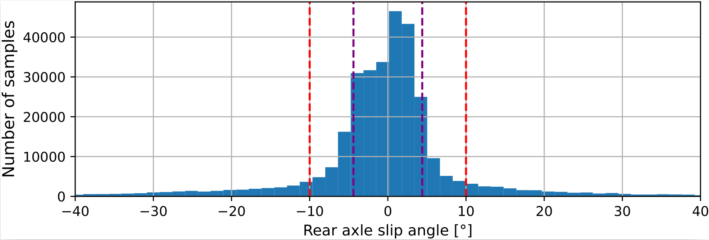

# Learning Dynamics Models for Velocity Estimation in Autonomous Racing

*Published on ArXiv*: [arXiv:2408.15610](https://www.arxiv.org/abs/2408.15610)

## Dataset: Aggressive Car Maneuver Data from F1Tenth Car and OptiTrack System

## Overview

This dataset contains high-resolution data recorded during aggressive maneuvers of an F1Tenth racing car. The vehicle operated with  sideslip angles reaching up to 40° and rear axle slip angles exceeding 20°. The distribution of rear axle slip angles can be observed in the histogram visualization provided below.

The data was captured using both the F1Tenth equiped with onboard sensors and an OptiTrack motion capture system. The dataset includes information such as motor current, RPM, pose in the OptiTrack reference frame, control signals, and IMU measurements. The recordings are stored in ROS2 bag files and are distributed across several topics, as detailed below.

<video width="640" height="360" controls>
  <source src="dataset/video/f1tenth_iros.mp4" type="video/mp4">
  Your browser does not support the video tag.
</video>

This video illustrates the aggressive maneuvers performed by the F1Tenth car during the data collection process. It highlights the extreme driving conditions, including high side slip angles and rapid changes of direction, which were essential for developing estimation algorithms for agile driving.

## Data Description

### Topics and Messages

The dataset is structured into several ROS2 topics, each containing specific sensor and control data from the vehicle and the OptiTrack system.

1. **/vesc/core**  
   Contains information about the F1Tenth car's motor state:
   - `msg.state.current_motor`: Current on the engine (measured in Amps)
   - `msg.state.speed`: RPM of the engine (note: gear ratio needs to be added)

2. **/optitrack/rigid_body_0**  
   Provides the car's position and orientation in the OptiTrack reference frame:
   - `msg.pose.position.x`: Position in the x-axis
   - `msg.pose.position.y`: Position in the y-axis
   - `msg.pose.orientation`: Orientation quaternion in the OptiTrack frame

3. **/vesc/servo_position_command**  
   Contains the control signal for the servo controlling the car's steering:
   - `msg.data`: Servo position control signal

4. **/commands/motor/current**  
   Contains the control signal for the motor’s current:
   - `msg.data`: Engine current control signal

5. **/imu**  
   Provides the vehicle's inertial measurements:
   - `msg.linear_acceleration`: Linear acceleration in the x, y, and z axes (measured in m/s²)
   - `msg.angular_velocity`: Angular velocity in the x, y, and z axes (measured in rad/s)
   - `msg.orientation`: Orientation in the IMU reference frame (quaternion)

### Data Split Based on Tire Friction Conditions

The dataset is split into four subsets corresponding to different tire conditions: **Tire A**, **Tire B**, **Tire C**, and **Tire D**. Each tire configuration was tested under varying road friction conditions, with each having a distinct coefficient of road-tire friction (μ). Specifically, **Tire A** has a friction coefficient of approximately μA ≈ 0.65, **Tire B** has a friction coefficient of approximately 0.58, **Tire C** around 0.43, and **Tire D** around 0.45. These variations in friction coefficients allow for the study of the vehicle's dynamic behavior under different traction scenarios, making this dataset useful for analyzing the impact of tire friction on maneuverability and velocity estimation.

## Usage

The dataset is ideal for researchers and engineers looking to explore vehicle dynamics, develop autonomous racing algorithms, or study aggressive maneuvering behavior in small-scale racing platforms. The combination of motor, IMU, and OptiTrack data provides a rich source for velocity estimation, dynamic modeling, and control system design.
